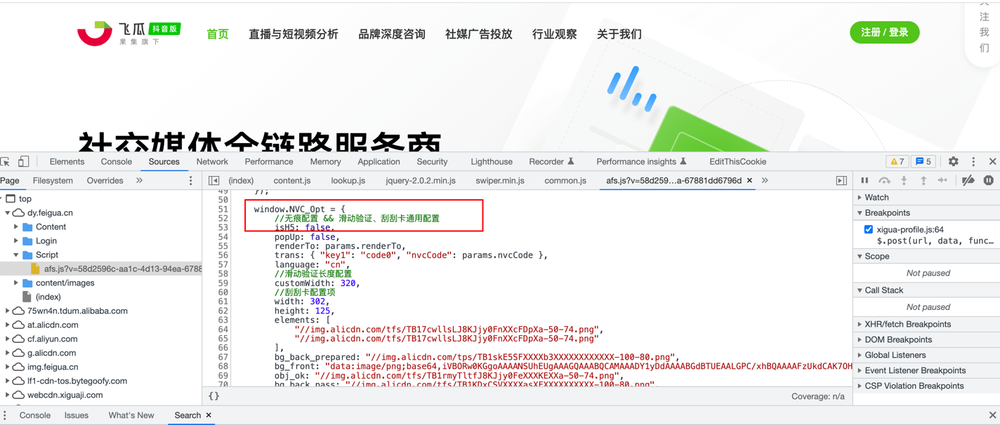
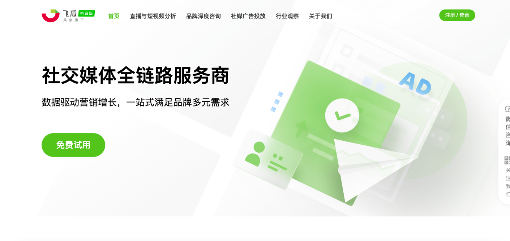
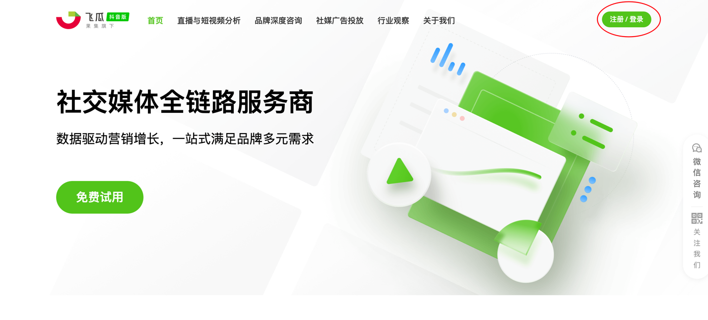
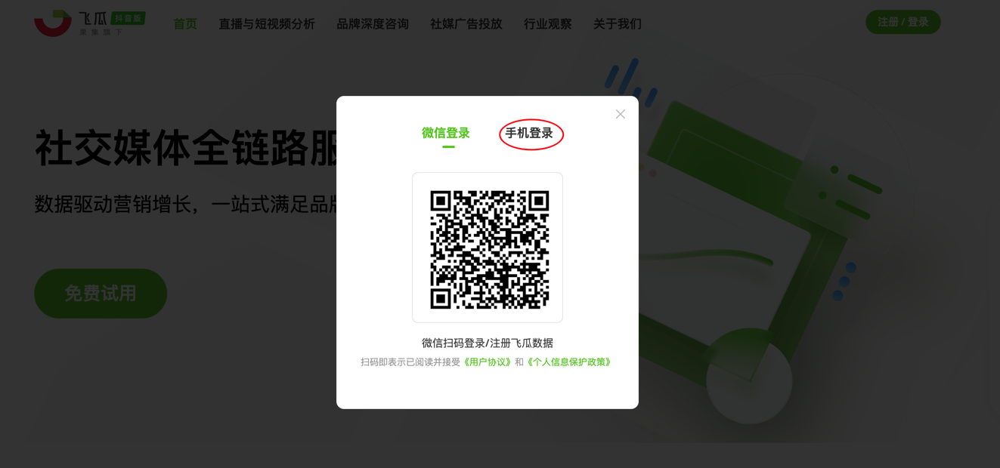
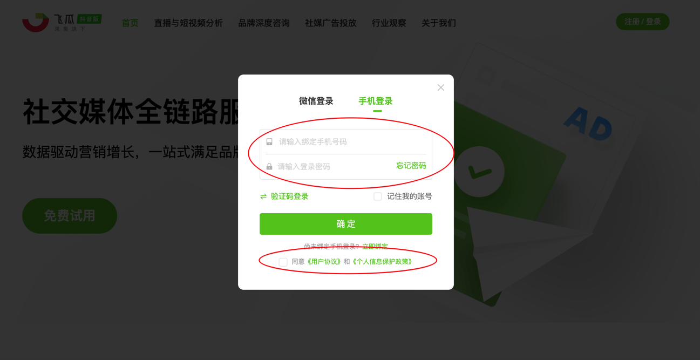
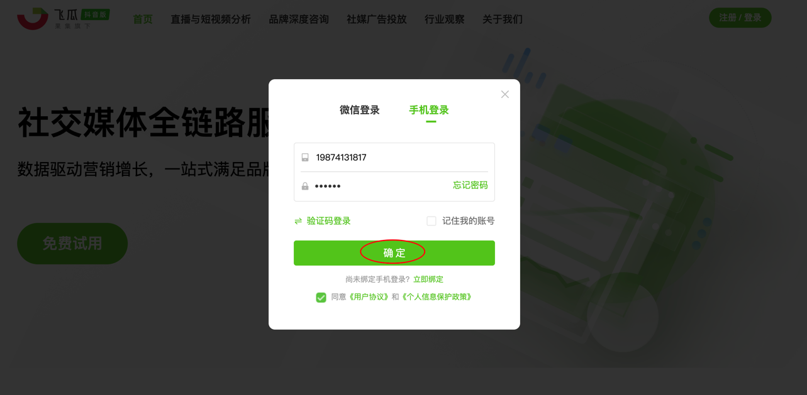

# 成功绕过阿里无痕验证码，一键爬取飞瓜数据

飞瓜数据的登录接口，接入了阿里云的无痕验证码；通过接口方式模拟登录，难度比较高。所以，我们使用自动化的方式来实现模拟登录，并且获取到 cookie 数据。


[] https://help.aliyun.com/document_detail/122247.htm

## 使用 Playwright 库实现自动化模拟登录

- 打开首页

```python
page.goto("https://dy.feigua.cn//")
```



- 点击 右上角登录按钮

```python
page.wait_for_timeout(random.randint(2, 5) * 1000)
page.click("xpath=//div[@class=\"header-btn \"]")
```



- 点击 手机登录 Tab 栏

```python
page.wait_for_timeout(random.randint(2, 5) * 1000)
page.click("xpath=//a[@data-logintype=\"phonepwd\"]")
```



- 填写 账号、密码, 点击 同意用户协议

```python
page.wait_for_timeout(random.randint(2, 5) * 1000)
page.fill("xpath=//input[@id=\"fb_login_phonepwd_tel\"]", "xxx")
page.fill("xpath=//input[@id=\"fb_login_phonepwd_pwd\"]", "xxx")
page.evaluate("document.getElementById(\"cbAgree2\").checked = true")
```



- 点击 确定
```python
page.wait_for_timeout(random.randint(2, 5) * 1000)
page.click("xpath=//a[@id=\"fb_login_phonepwd_btnyes\"]")
```



- 把 Cookies 保存下来

```python
page.wait_for_timeout(random.randint(10, 15) * 1000)
cookies = context.cookies()
with open("cookies.txt", "w") as f:
    f.write(json.dumps(cookies))
```

## 使用 Cookie 通过接口进行爬取数据

使用上面保存下来的 cookie 数据，来调用接口。

```python
# 读取 cookies
with open("cookies.txt", "r") as f:
    content = f.read()
    cookies = json.loads(content)

cookie_dict = {}
for cookie in cookies:
    cookie_dict[cookie["name"]] = cookie["value"]

cookies = cookie_dict

# 设置 Header 头
headers = {}

params = {
    "pageIndex": "1",
    "pageSize": "10",
    "period": "day",
    "datecode": "20230419",
    "_": "1681972040924",
}

response = requests.get("https://dy.feigua.cn/api/v1/bloggerrank/growingUpRank", params=params, cookies=cookies, headers=headers)
print(response.json())
```

数据结果
```json
{
	"Data": {
		"ExportUrl": "/Rank/ExportGrowingUp?tag=全部&period=day&datecode=20230419",
		"RankUpdateTime": "2023/04/20 04:00:00",
		"UpdateTime": "0001/01/01 00:00:00",
		"Total": 1499,
		"TotalStr": "1499",
		"List": [{
			"Rank": 1,
			"Uid": "2120325320935144",
			"Avatar": "https://p6.douyinpic.com/aweme/720x720/aweme-avatar/tos-cn-avt-0015_ba0499e9f25504a69aeca793d5f42838.heic?from=2956013662&$$dyurl=https://logocdn.feigua.cn/BloggLogo/afe3da3d0f8601509733281d4fe572f5.jpg",
			"NickName": "很烦.",
			"BloggerTags": "生活",
			"CustomVerify": "",
			"EnterpriseVerify": "",
			"Platform_Fans": "34.8w",
			"IncFans": "5.5w",
			"IncScore": "253.0",
			"IncLikeCount": "281.2w",
			"BloggerDetailLink": "#/blogger-detail/index?bloggerId=36664750&tab=&ts=1681971184&sign=b676710b12388b81200f6197eb5c25ef",
			"RankNumTipType": 4,
			"RankNumIncVal": 0
		}, {
			"Rank": 2,
			"Uid": "101333617940",
			"Avatar": "https://p3.douyinpic.com/aweme/720x720/aweme-avatar/tos-cn-i-0813c001_3d45ebb95be34ffd90e1c32f69211b6e.heic?from=2956013662&$$dyurl=https://logocdn.feigua.cn/BloggLogo/d837b86e911679384a44c8c93966829f.jpg",
			"NickName": "小鱼末世馆",
			"BloggerTags": "文学艺术",
			"CustomVerify": "",
			"EnterpriseVerify": "",
			"Platform_Fans": "43.7w",
			"IncFans": "25.8w",
			"IncScore": "227.0",
			"IncLikeCount": "34.7w",
			"BloggerDetailLink": "#/blogger-detail/index?bloggerId=11402981&tab=&ts=1681971184&sign=e1a36616a006017a6672917d2a0154b6",
			"RankNumTipType": 4,
			"RankNumIncVal": 0
		}
	},
	"Code": 200,
	"Msg": "",
	"Status": "True"
}
```

# 小结
- 飞瓜数据的登录接口，接入了阿里云的无痕验证码；因此通过接口方式实现模拟登录，难度大。
- 使用 Playwright 库通过模拟人的行为，进行了自动化的登录操作，最终提取 Cookie。
- 通过将 Cookie 应用到其他的接口上，可以正常获取到数据。
- 最后，声明本篇文章仅供学习参考，网络不是法外之地，切勿进行非法用途。
