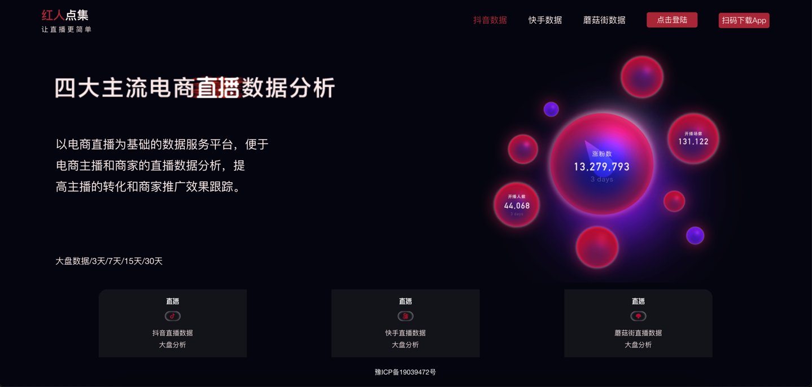
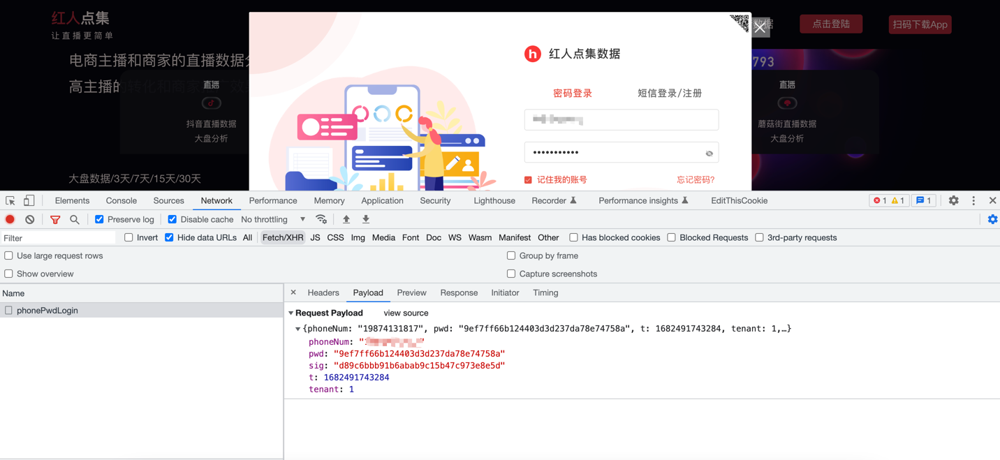
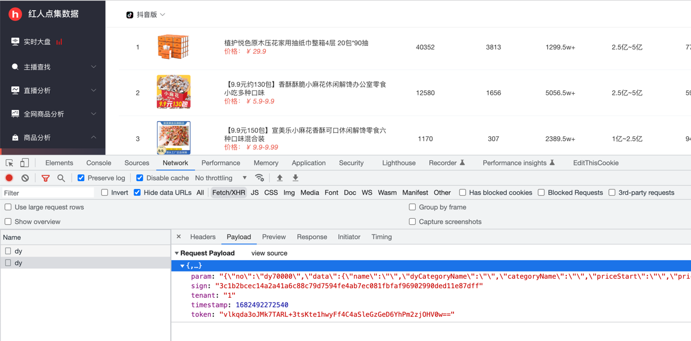

# 抽丝剥茧成功破解红人点集的签名加密算法



## 抽丝剥茧破解登录签名算法，成功实现模拟登录



```python
headers = {}

phone_num = "xxxx"
password = "xxxx"
md5_hash = hashlib.md5()
md5_hash.update(password.encode())
hex_digest = md5_hash.hexdigest()

data = {
    'phoneNum': phone_num,
    'pwd': hex_digest,
    't': int(time.time() * 1000),
    'tenant': 1,
}

with open('sign.js', 'r', encoding='UTF-8') as f:
    js_code = f.read()
    context = execjs.compile(js_code)
    sign = context.call("get_sign", data['phoneNum'], data['pwd'], data['t'])
data['sig'] = sign

response = requests.post('https://user.hrdjyun.com/wechat/phonePwdLogin', headers=headers, json=data)
print(response.json())
```

登录成功之后，返回的 Token。
```python
{
    "status": 0,
    "message": "成功",
    "data": {
        "checkStatus": 0,
        "nickname": "xxxx",
        "token": "vlkqda3oJMk7TARL+3tsKte1hwyFf4C40osiPGOnd8o0SL7CS9OZ8A=="
    }
}
```

## 爬取红人点集的带货商品数据

模拟登录成功之后，将获取到的 Token；应用到其他的接口中，下面是调用获取带货商品数据的接口。
接口的签名字符串，通过 & 将参数拼接好；之后，再通过 sha256 算法进行加密。



```python
headers = {}

token = 'vlkqda3oJMk7TARL+3tsKte1hwyFf4C4+N0X+t4+BAshPm2zjOHV0w=='
data = {
    'param': '{"no":"dy70000","data":{"name":"","dyCategoryName":"","categoryName":"","priceStart":"","priceEnd":"","salesVolumeStart":"","salesVolumeEnd":"","orderBy":"salesMoney30","order":"desc","pageSize":100,"pageNum":1,"cosRatioStart":""}}',
    'tenant': '1',
    'timestamp': int(time.time() * 1000),
    'token': token,
}

sign_str = 'param={}&timestamp={}&tenant=1&salt=kbn%&)@<?FGkfs8sdf4Vg1*+;`kf5ndl$'.format(data['param'], data['timestamp'])
sign = hashlib.sha256(sign_str.encode('utf-8')).hexdigest()
data['sign'] = sign

response = requests.post('https://ucp.hrdjyun.com:60359/api/dy', headers=headers, json=data)
print(response.json())
```

爬取到的数据，这里只展示部分数据。
```python
{
	'status': 0,
	'message': '成功',
	'data': {
		'total': 10989338,
		'data': [{
			'anchorNum': 187,
			'anchorNum3': 301,
			'anchorNum7': 428,
			'anchorNum15': 582,
			'anchorNum30': 756,
			'liveNum': 268,
			'liveNum3': 845,
			'liveNum7': 1929,
			'liveNum15': 3715,
			'liveNum30': 6083,
			'categoryName': '生鲜',
			'cosRatio': 0.0,
			'displayMoney30': '1亿~2.5亿',
			'displaySales30': '108.5w+',
			'gmv_score30': '43.51',
			'id': '3606479076967209853',
			'img': 'https://p6-item.ecombdimg.com/img/ecom-shop-material/KXESrDL_m_35388000a3b1d9f54123b01d380a53d2_sx_589861_www800-800~tplv-5mmsx3fupr-resize:1080:1080.webp',
			'maxPrice': 9980,
			'minPrice': 9980,
			'name': '天海藏7盒装麻辣小龙虾尾250g 35只左右/盒（套餐）',
			'platform': 'dy',
			'salesMoney': 352802980,
			'salesMoney3': 1506540880,
			'salesMoney7': 3906371600,
			'salesMoney15': 6716320440,
			'salesMoney30': 10877451500,
			'salesVolume': 35351,
			'salesVolume3': 150956,
			'salesVolume7': 391420,
			'salesVolume15': 672978,
			'salesVolume30': 1089925,
			'sales_score30': '43.60',
			'staticTime': 1682461200037,
			'tbCatName': '生鲜',
			'thirdItemId': '3606478578751027192',
			'awemeNum': 45,
			'displayMoney7': '2500w~5000w',
			'displaySales7': '39w+',
			'gmv_score7': '78.13',
			'sales_score7': '78.28'
		}]
	},
	'hasMore': None,
	'totalCount': None,
	'success': True
}
```

## 小结
- 红人点集登录操作的签名算法，是自研的加密算法；通过抽丝剥茧，成功逆向了算法。
- 然后通过模拟登录，拿到了接口的调用凭证 Token。
- 使用 Token 调用其他的接口，便可以爬取到带货商品数据。
- 最后，声明本篇文章仅供学习参考，网络不是法外之地，切勿进行非法用途。
