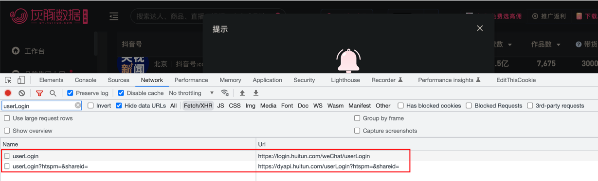
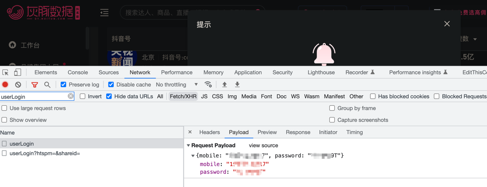
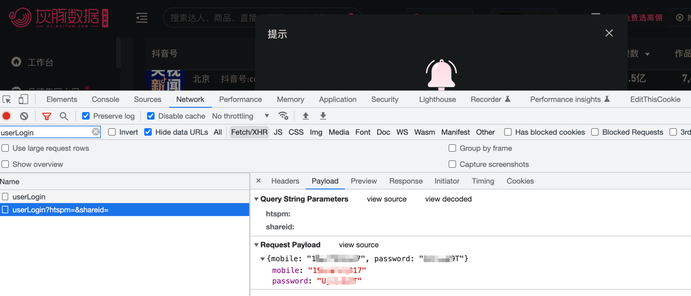
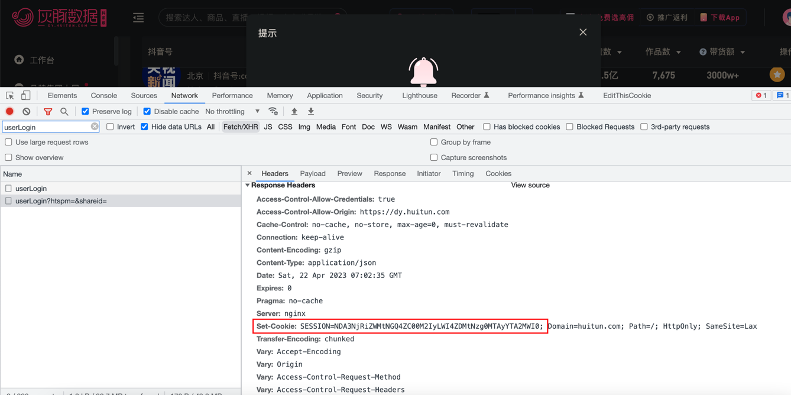
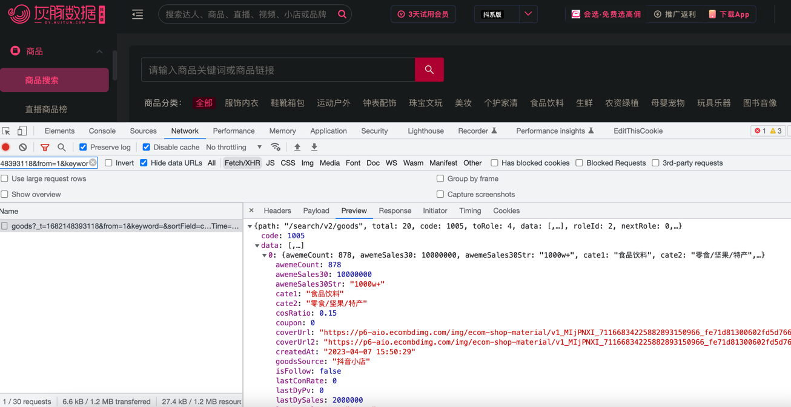

## 轻松爬取灰豚数据的抖音商品数据

## 调用两次登录接口实现模拟登录

我们分析登录接口，发现调用了两次不同的接口；而且，需要先调用 `https://login.huitun.com/weChat/userLogin`，然后再调用 `https://dyapi.huitun.com/userLogin` 接口。



登录成功之后，SESSION 在第二个接口的 Cookie 中返回。


```python
headers = {}
json_data = {
    'mobile': 'xxxx',
    'password': 'xxxx',
}
response = requests.post('https://login.huitun.com/weChat/userLogin', headers=headers, json=json_data)
print(response.json())

# 输出的结果
# {'status': 200, 'code': 20001, 'message': '登录成功!', 'extData': 0}
```

```python
cookies = {}

headers = {}

params = {
    'htspm': '',
    'shareid': '',
}

json_data = {
    'mobile': 'xxxx',
    'password': 'xxxx',
}

response = requests.post('https://dyapi.huitun.com/userLogin', params=params, cookies=cookies, headers=headers, json=json_data)
print(response.cookies.items())

# 输出的结果
# [('SESSION', 'NzAyNDQ4MjMtMGMyZS00OTBiLThiMWUtMTNmZWNkMjkxYThh')]
```

## 爬取商品数据

我们使用上面获取到的 SESSION，调用商品接口。


```python
cookies = {
    'SESSION': 'YmIzODMwZjYtMTBmMC00NzViLTg3NDctNjQ2OGM5NDE1NzU4',
}

headers = {}

params = {
    '_t': '1682146378787',
    'cids': '10117',
}

response = requests.get('https://dyapi.huitun.com/search/user', params=params, cookies=cookies, headers=headers)
print(response.json())
```

返回的数据结果，这里只展示部分数据。
```python
{
	'code': 0,
	'toRole': 3,
	'data': [{
		'authorId': 'dongfangzhenxuan',
		'avatarUrl': 'https://p3.douyinpic.com/aweme/200x200/aweme-avatar/tos-cn-avt-0015_34583dc5dc55d5983f8a57fafcbceb6d.jpeg',
		'awemeCount': 4146,
		'awewe30Count': 0,
		'category': '剧情',
		'cid': '10139',
		'city': '北京',
		'collect': False,
		'digg30IncCount': 0,
		'enterpriseVerifyReason': '东方甄选（北京）科技有限公司',
		'follower30IncCount': 0,
		'followerCountTotal': 29853836,
		'gender': '未知',
		'htScore': 0.0,
		'isFollow': False,
		'isStar': False,
		'isVerified': False,
		'live': True,
		'liveGmv30': 400000000,
		'liveGmv30Str': '4亿+',
		'mcn': False,
		'monitor': False,
		'nickname': '东方甄选',
		'record': False,
		'roomId': '7224668581445847845',
		'score': 0.0,
		'signature': '新东方集团、新东方在线唯一农产品直播带货平台\n客服电话：400-068-6666',
		'totalFavorited': 142631625,
		'uid': '2384194153219051',
		'withFusionShopEntry': True
	} ],
	'roleId': 2,
	'count': 5,
	'sum': 3,
	'message': '',
	'nextRole': 0,
	'path': '/search/user',
	'total': 20,
	'status': 200
}
```

## 小结
- 灰豚数据的登录需要调用两次不同的登录接口，而且要注意先后顺序。
- 登录成功之后，需要从 Cookie 数据中提取出 SESSION。
- 将 SESSION 应用到其他数据接口，便可以爬取到数据了。
- 最后，声明本篇文章仅供学习参考，网络不是法外之地，切勿进行非法用途。
